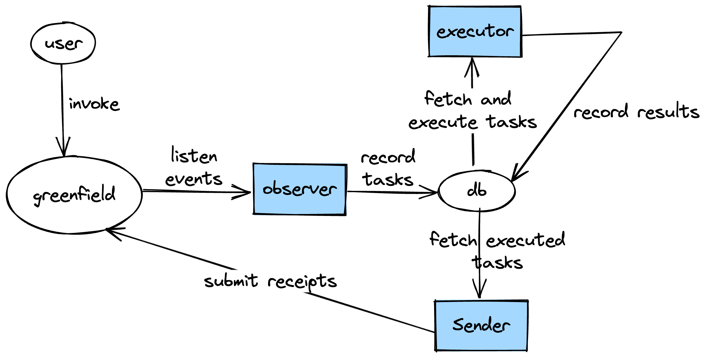

# Greenfield Execution Provider

## Overview



The Greenfield Execution Provider will execute the execution tasks invoked in greenfield and submit the results to the greenfield.

There are three components in the Greenfield Execution Provider:

1. Observer

    The observer will observe the execution tasks in the greenfield and record the execution tasks in the database.

2. Executor
    
    The executor will execute the execution tasks in the database and upload the result files to the greenfield.

3. Sender
    
    The sender will send the executed task receipts to the greenfield.

## Run

### Setup local environment

Execute the following command to setup the local environment:

```bash
make local_up
```

This command will start a local greenfield chain and a local storage provider. 

### Build binaries

Execute the following command to build the binaries:

```bash
make all
```

This command will build the binaries in the `build` directory, including the observer, executor and sender.

